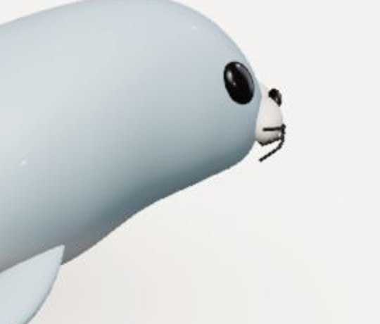

> 历史首轮记录，已被 [修复复验结果](REPORT.md) 取代。首轮没有修改代码；后续已完成多轮修复。原根目录中螃蟹、海豹的6张front/side静态图曾被修复版覆盖，不能再作为旧版证据；旧版动态图及其他原始记录仍保留。

# 全伙伴重新验收 · 2026-09-09

**结论：整体不通过，未达到「新增伙伴成功标准」的全部退出条件。** 已在 Codex 内置浏览器逐只检查 9 个伙伴的正面及两侧（27 个视角），并保留真实 WebGPU 截图、操作记录和内部检查日志。完成本轮复验及问题清单，不代表所有验收项已经通过。本轮没有修改模型、头像或运行代码，也没有发布。

## 确认的问题

| 优先级 | 伙伴 / 范围 | 实际差异与影响 | 证据 / 后续复查 |
| --- | --- | --- | --- |
| P1 | 螃蟹 · 双钳 | 双钳过度圆球化，掌部和螯指都像叠加圆球，缺少两根螯指相对夹合的轮廓及清楚钳口，主要读成拳头，物种关键特征不成立。用户本轮明确指出，判为失败。 | [正面](crabmochi-front.png)、[侧A](crabmochi-side-a.png)、[侧B](crabmochi-side-b.png)、[举钳](crabmochi-front-poke.png)；`coastalmochi.ts:184–187`双螯造型。保留圆润风格，重做螯指分叉、相向尖端与夹口负形，再重查三视角和举钳/拉扯。 |
| P1 | 海豹 · 两侧 | 笑嘴弧线与脸部之间有背景色空隙，默认静止与戳动截图均存在，属于五官未贴肤。 | [侧A](sealmochi-side-a.png)、[侧B](sealmochi-side-b.png)、[动作](sealmochi-side-a-poke.png)、[放大](sealmochi-side-a-zoom.png)；`src/characters/coastalmochi.ts:201–203`。修复笑嘴曲面贴合后重查正面和两侧及变形。 |
| P2 | 金鱼 · 两侧形态 | 实际模型缺少腹鳍与臀鳍；不能按要求核对附肢数量和位置后直接通过。双尾的空间形态仍需选定观赏品系照片进一步对照。 | [侧A](goldmochi-side-a.png)、[侧B](goldmochi-side-b.png)；`goldmochi.ts:92`。已有形态资料见下方来源；修复或由用户明确接受简化后同条件复查。 |
| P2 | 鲨鱼 · 两侧形态 | 每侧仅3条鳃裂，另无腹鳍模型；与可信形态资料中的鲨鱼5–7条鳃裂、腹鳍结构不符。臀鳍有物种例外，不按泛称强制所有种相同。 | [侧A](sharkmochi-side-a.png)、[侧B](sharkmochi-side-b.png)；`sharkmochi.ts:158,191`。需要明确原型并修复，或明确接受符号化简化。 |
| P2 | 鲸鱼 · 帽子 | 无其他饰品时，帽冠下缘和帽檐之间仍露出蓝色头部，呈现穿插/贴合错误。 | [只戴帽子](whalemochi-combo-hat-00.png)、[放大](whalemochi-combo-hat-00-zoom.png)；`src/core/accessories.ts:14,56–61`。调定位后检查正面、两侧、变形和其他饰品组合。 |
| 检查失败 | 金鱼测试 | `test:physics` 在侧鳍射线断言失败；不是“所有鱼鳍抓不到”。真实页面正面/两侧均命中独立鳍句柄。 | [失败日志](checks/test-physics.log)、[命中记录](goldmochi-visible-fin-hit.json)、[实际拖动](goldmochi-visible-fin-drag.png)、[全视角附肢记录](limbs.json)。旧测试射线需校准并复跑，当前不擅自改绿。 |
| 检查失败 | 静态质量 | lint 有30条既有错误，涉及组件无障碍规则、React effect、链接规则等。 | [完整位置](checks/summary.md)、[lint日志](checks/lint.log)。本轮没有改变这些文件。 |

螃蟹钳子问题最初被过于宽松地归为“待裁定”，用户纠正后明确按**物种形态失败**处理。问题是钳子轮廓与夹口不成立，不能因网格完整、双螯数量正确或动作能执行而通过。鲸鱼眼镜横杆经过眼睛中部，但单独眼镜对照仍能见黑眼；不采用“耳机和眼镜把眼睛完全遮没”的早期疑点。泛称鲸鱼不能仅因无背鳍判失败，弓头鲸等确无背鳍。

海豹问题示例（本轮实际渲染的局部放大）：

## 逐伙伴结论

这里的“失败”表示已找到未关闭的必验问题；“未完成”表示没有足够证据宣布整体通过。没有把“暂未看到破裂”升级成完整形态或体验通过。

| 伙伴 | 本体 / 饰品结果 | 头像结果（并行专项报告） | 综合状态 |
| --- | --- | --- | --- |
| 八爪鱼 | 8腕、腕根融合和两侧卷腕已看；各视角身体/腕足可命中，截图未见明显破裂。仍有下述共通证据缺口。 | 首项手机键盘焦点外圈裁切；腕足裁切待确认。 | 失败（头像），本体验收未完全关闭 |
| 墨鱼 | 扁长体、连续裙鳍、8短腕+2长触腕具备；三视角身体/腕足已测，未见明显破裂。 | 长触腕圆形裁切待确认。 | 未完成 |
| 鱿鱼 | 锥形外套膜、上部双鳍、8短腕+2长触腕具备；补定位后双侧身体命中，三视角触腕命中。 | 专项浏览器已测项通过，真机触摸未验证。 | 未完成（共通证据缺口） |
| 金鱼 | 下部鳍缺失；旧拾取测试失败，但三视角可见鳍可独立抓取。 | 头像顶部鳍/体形与模型不一致，顶鳍裁切。 | 失败 |
| 鲸鱼 | 水平尾叶与胸鳍具备；帽子贴合失败；不强制其拥有背鳍。 | 眼位、笑口及腹部纹理与模型不同。 | 失败 |
| 鲨鱼 | 3鳃裂、下部鳍结构不足；尖吻、背鳍与垂直尾可辨。 | 眼位、吻部不同，背鳍裁切。 | 失败 |
| 海豹 | 两侧笑嘴悬空；四鳍具备，三视角鳍可抓取，扑鳍动作留图。 | 主体/脸部视觉过小。 | 失败 |
| 海龟 | 壳、独立头部、四鳍与尾具备；身体/鳍拖动及缩头动作留图，未见明确裂口。 | 专项浏览器已测项通过，真机触摸未验证。 | 未完成（共通证据缺口） |
| 螃蟹 | 八步足+双螯具备；三视角身体/螯可抓取，但钳子圆球化、缺少夹口，关键形态失败。 | 末项手机键盘焦点外圈裁切。 | 失败（双钳形态及头像） |

头像结论引用同工作区并行产生的[头像专项报告](../avatar-acceptance-2026-09-09/REPORT.md)，它是独立来源，不冒充本任务完成的A项逐一验收；其自身仍注明暂定及真机缺口。本任务原始源码前后相同，不引入新的头像/模型一致性变化。任务进行期间 `PRODUCT.md` 新增头像标准、`target-reference.png` 被其他工作删除，均原样保留。

## 27个必验视角

全部9只已实现侧面接口，鱼类与海岸三伙伴还可在正常拖头时露出侧面。各模型存在同向卷腕、偏置五官或左右附肢动态相位差，因此两侧分别检查。来源及源码角度见 [模型审查](model-audit.md)。

“侧A/侧B”是稳定取证名称，不混用动物左侧与屏幕左右：侧A采用已有 `view:'side'`；侧B在此基础上增加π旋转。鲸/鲨侧A yaw=0、侧B=π；其余侧A=π/2、侧B=3π/2。正面使用各模型原始front定义，金鱼为−0.2，鲸/鲨为π/2，其余为0。

| 伙伴 | 正面 | 侧A | 侧B |
| --- | --- | --- | --- |
| 八爪鱼 | [front](octomochi-front.png)：轮廓/五官已看 | [side-a](octomochi-side-a.png)：腕根与卷曲已看 | [side-b](octomochi-side-b.png)：反侧卷曲已看 |
| 墨鱼 | [front](cuttlemochi-front.png)：腕冠与五官已看 | [side-a](cuttlemochi-side-a.png)：扁体/裙鳍已看 | [side-b](cuttlemochi-side-b.png)：反侧裙鳍已看 |
| 鱿鱼 | [front](squidmochi-front.png)：锥体/双鳍已看 | [side-a](squidmochi-side-a.png)：鳍根与腕冠已看 | [side-b](squidmochi-side-b.png)：反侧鳍根已看 |
| 金鱼 | [front](goldmochi-front.png)：侧鳍可抓；头像不一致 | [side-a](goldmochi-side-a.png)：下部鳍缺失 | [side-b](goldmochi-side-b.png)：下部鳍缺失 |
| 鲸鱼 | [front](whalemochi-front.png)：帽子贴合失败 | [side-a](whalemochi-side-a.png)：水平尾/胸鳍已看 | [side-b](whalemochi-side-b.png)：反侧尾柄已看 |
| 鲨鱼 | [front](sharkmochi-front.png)：尖吻/背鳍已看 | [side-a](sharkmochi-side-a.png)：鳃裂/下部鳍差异 | [side-b](sharkmochi-side-b.png)：鳃裂/下部鳍差异 |
| 海豹 | [front](sealmochi-front.png)：前脸已看 | [side-a](sealmochi-side-a.png)：笑嘴悬空失败 | [side-b](sealmochi-side-b.png)：笑嘴悬空失败 |
| 海龟 | [front](turtlemochi-front.png)：头/壳/前鳍已看 | [side-a](turtlemochi-side-a.png)：头壳和四鳍已看 | [side-b](turtlemochi-side-b.png)：反侧已看 |
| 螃蟹 | [front](crabmochi-front.png)：双钳圆球化失败 | [side-a](crabmochi-side-a.png)：钳口形态失败 | [side-b](crabmochi-side-b.png)：钳口形态失败 |

每个格子的身体拖动释放、专属动作截图采用同名前缀加 `-drag-release.png` / `-poke.png`；附肢加 `-limb-drag.png`。最初坐标未命中的项另存 `-limb-recheck.png`，鱿鱼侧面身体另存 `-body-recheck.png`；原始未命中记录保留，最终以成功补测为准。每格目前只检查代表性附肢，**不代表该视角每根腕足/每片鳍全部遍历**。

## 已执行的语义、交互与兼容性检查

- 真实页面：图鉴进入八爪鱼；九伙伴直达入口和键盘Enter选择均对应正确模型/选中项。快速连续选择海豹→海龟→螃蟹，最终显示螃蟹并保留机械材质和眼镜。[键盘记录](keyboard-selection.json)、[快速切换](rapid-switch.png)。
- 27视角：身体拖动、释放回调、戳动留图；鱿鱼两侧首次坐标在身体外，重新定位后均命中`mantle`。各视角代表性附肢均最终命中独立句柄。[身体操作](interactions.json)、[附肢命中](limbs.json)。没有以“拖过但未命中”算成功。
- 九伙伴：默认色/草莓粉/珊瑚橙/薄荷绿可选择；软硬设0、阻尼设100，恢复后回到48/42；三材质逐次切换，帽子/蝴蝶结互斥，恢复原状清空饰品并选回软胶。[兼容性记录](compatibility.json)。调色截图与原始材质基线可对照；手感差异另由对应Node参数测试提供有限数值证据。
- 九伙伴×12种合法饰品组合：软胶下逐项操作（耳机开/关×眼镜开/关×头顶空/帽/蝴蝶结），108个实际选择集合与期望完全一致。[组合记录](combinations.json)。三材质另外使用耳机+眼镜+帽子，以及机械耳机+眼镜+蝴蝶结留图；**没有把它写成三材质×全部组合×全部视角的穷举验证**。
- 螃蟹：滑块获得焦点时按Space未触发戳动，画布获得焦点时Space触发动作；共享输入其他角色的键盘焦点边界没有逐一穷举。
- 手机：390×844与320×740逐只默认取景截图，390×844逐只指针拖动；模型首屏未见边缘裁切。设置区滚动、材质切换与重置已在螃蟹页实际操作。[设置区](mobile-controls.png)、[手机记录](mobile.json)。这是响应式视口和桌面指针输入，**不是手机真机触摸验证**。
- 最终浏览器DOM后端为`WebGPU`，读取错误日志为空；不是WebGL替代或离线渲染。UI提示和截图证明本轮能正常加载，未注入加载失败验证恢复链。

## 内部检查

[完整结果](checks/summary.md)：18条实际执行命令，16通过、2失败（包括移除临时调试后的typecheck/build复查）。9个npm测试套件中8通过，物理套件在金鱼侧鳍断言失败；被短路跳过的鲸鱼、鲨鱼和机械八爪鱼单独补跑通过。`test-smiles`通过，lint失败。测试能力与遗漏见[覆盖表](checks/coverage.md)。

最终原始源码 `git diff -- src` 为空，typecheck、build通过。内部脚本不创建浏览器Renderer，不能替代视觉或真实触屏证据。

## 仍未关闭的必验项

1. **形态参考配对不完整。** 已核查可信机构/论文资料，但并未获得并实际阅读全部9只正面+双侧对应照片。严格的“参考→实际渲染”逐视角配对仍有缺口；不能用参考URL清单或另一只伙伴替代。详见[资料范围](anatomy-sources.md)。
2. **持续按压、取消/失焦与完整释放恢复**未在27视角逐项留下连续运行证据。本轮真实拖动覆盖按下/移动/释放，但没有把短时按下当作独立持续按压；单帧动作图也不能证明全过程没有持续穿插或最终完全恢复。已发现的海豹静态贴合问题无需等待动态证据才判失败。
3. **全部材质下的侧面动态与饰品跟随**未做完整交叉覆盖；现有Node数值测试仅提供辅助证据。
4. **真机触屏**、触摸取消、画布外滚动不受手势干扰未实测；390/320宽度不是新增最低设备支持承诺。
5. **独立真实黑盒旅程**未完成。独立代理环境只暴露Chrome，没有内置浏览器，因此遵守用户要求未改用Chrome；独立代理实际完成的是截图复核，不能替代其亲自操作。复核细项与图像版本见[独立视觉报告](visual-review.md)。
6. **修复循环没有关闭。** 本轮为重新验收，确认问题后提出具体修复方向，未修改几何、饰品、测试或头像，也未获得对形态简化的明确接受。后续修复须回查该伙伴所有必验视角；共享饰品或裁切机制修改需回查全部受影响伙伴。

因此，不能对任何伙伴宣称已满足全部新增伙伴成功标准；明确失败项与未验证项是两种不同结论。

## 参考资料及使用边界

- [Smithsonian头足类形态](https://ocean.si.edu/ocean-life/invertebrates/octopuses-squids-and-relatives)：八爪鱼八腕、墨鱼/鱿鱼8腕+2触手。 [Monterey墨鱼](https://www.montereybayaquarium.org/animals-the-ocean/animals-a-to-z/broadclub-cuttlefish)：扁体与连续体缘鳍。
- [Animal Diversity Web金鱼](https://animaldiversity.org/accounts/Carassius_auratus/)：胸鳍、腹鳍、臀鳍、背鳍和尾鳍的数量/位置判据。双尾品系额外参考[原始论文图1](https://www.nature.com/articles/ncomms4360/figures/1)，该图直接打开受限，未声称完成图像对照。
- [Florida Museum鲨鱼形态图](https://www.floridamuseum.ufl.edu/wp-content/uploads/sites/66/2017/05/lesson_shark-anatomy-key.pdf)、[NOAA鲨鱼资料](https://spo.nmfs.noaa.gov/Circulars/CIRC119.pdf)：鳍结构与5–7鳃裂。 [NOAA弓头鲸](https://www.fisheries.noaa.gov/species/bowhead-whale)：无背鳍的反例。
- [NOAA海豹](https://www.fisheries.noaa.gov/species/harbor-seal)、[海龟](https://www.fisheries.noaa.gov/species/green-turtle)、[螃蟹](https://www.fisheries.noaa.gov/species/blue-crab)：具体形态判据及视角限制详见资料报告，不把蓝蟹或绿海龟所有种级特征强加给泛称卡通角色。

## 可复核条件

- 起始HEAD：`ac441c4d3107c2122ffaf02bbc7dc9ab0da8c9f9`；Node22.17.0、npm11.10.1、macOS、Codex内置Chromium，桌面1440×1000、手机390×844和320×740；无页面缩放操作。
- 运行本地开发版，通过实际产品入口操作；视角取证阶段仅临时加入`?audit`下7/8/9切角和拾取句柄记录，不改几何、材质、物理或渲染后端。该代码已移除，可用[取证补丁](audit-instrumentation.patch)复现；它不是永久功能，右侧工具栏未添加视角开关。
- 原始全窗口截图保留；局部放大仅用于说明细节，不替代原图。截图指纹见[screenshot-sha256.txt](screenshot-sha256.txt)。独立复核的明确张数以其报告为准，未检查的新增截图不冒充独立复核通过。
- 其他任务的产品文档、参考图删除、头像报告均未回退。无需长期交接文件：结论、未关闭项及复查条件已由本报告与代码低成本恢复。
