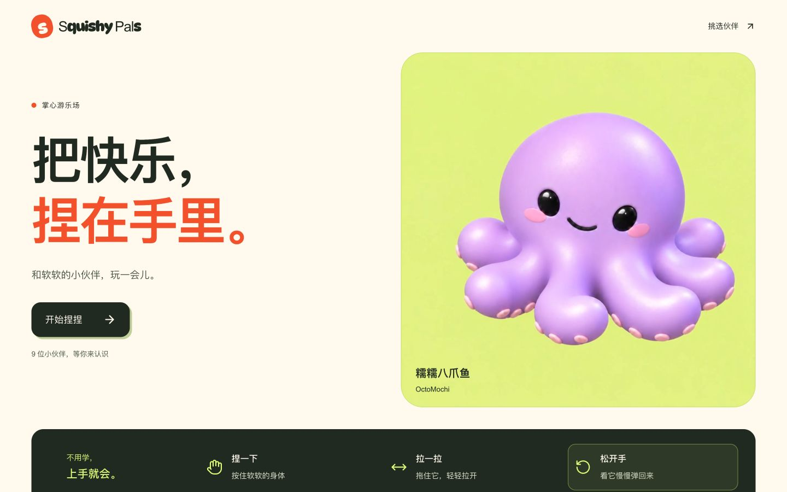
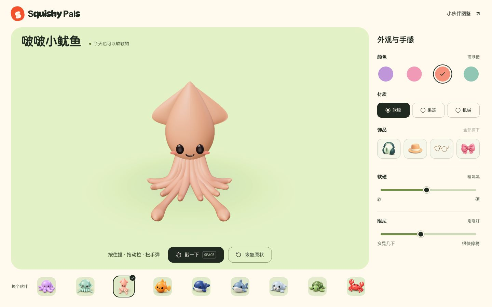

# 界面打磨审查与优化方案

状态：本文件保留实施前的审查依据。用户随后明确“开始修改”，已按下述方案应用到本地开发版本；修改结果和验证见 [IMPLEMENTATION.md](IMPLEMENTATION.md)。文案候选尚未完成人工逐行审核。

## 审查范围与依据

已实际浏览首页、九位伙伴图鉴、八爪鱼与鱿鱼试玩页及手机设置模式。依据现有 DESIGN.md 的「掌心游乐场」方向，以及 PRODUCT.md 的功能与恢复语义。目标是保留设计身份、减少重复和澄清操作，不改造角色、不添加视觉素材。

最初通过 Chrome 检查，用户指定内置浏览器后，后续全部改用内置浏览器复核。内置浏览器原有地址不可访问，已在其中打开当前可用的项目预览。

| 设备/范围 | 实际视口 | 观察范围 |
| --- | --- | --- |
| 桌面 | 1440×900 | 首页、完整图鉴、试玩与右侧设置；内置浏览器再次核对首页和鱿鱼试玩 |
| 平板 | 834×1112 | 首页、图鉴、试玩及设置下排；内置浏览器再次核对鱿鱼试玩 |
| 手机 | 390×844 | 首页、图鉴、试玩、设置展开；内置浏览器再次核对图鉴末项、鱿鱼试玩及设置 |
| 窄屏 | 320×740 | 八爪鱼试玩和设置，读取控件实际尺寸 |
| 设置断点 | 600/601、1000/1001×900 | 设置显隐/重排与页面宽度读取；四个宽度均未发现整页横向溢出 |

上述是审查覆盖，不是全部功能验收。真机触摸、完整键盘旅程、错误注入、全部伙伴材质/形变均未验证；首页和图鉴其余断点尚未逐项复核。由于本轮只交付方案，没有修改后视觉比较，也未运行构建与物理测试。

## 建议实施顺序

| 优先级 | 位置与观察 | 优化方案 | 应保留的能力/表达 |
| --- | --- | --- | --- |
| 1 | 画布无障碍提示为「空格弹跳」，但 PRODUCT 规定空格触发各伙伴专属戳动动作 | 改为「按空格戳一下」，与可见按钮同名；操作后反馈只描述触发或状态，不承诺情绪效果 | 现有快捷键及各伙伴动作差异 |
| 1 | 手机「全部摘下」实际为48×24px，「回到捏玩」为86×36px | 扩大点击区域，建议高度约44px；保持当前文字大小，不用扩大字形来凑触控面积；窄屏确认不重叠 | 清空饰品、返回后设置与焦点保留 |
| 2 | 首页主标题前有眉题和橙点，按钮下另有数量邀请；图鉴再次呈现名称和数量 | 首页优先删除眉题及邀请句；伙伴数量只在图鉴保留一次 | 现有主标题、说明、开始按钮和挑选入口 |
| 2 | 首页玩法区用整块深绿底、黄绿图标、口号与选中框形成第二个强焦点；手机占用较多纵向空间 | 先尝试奶油底上的直接三步排列，标题用「玩法演示」；只对当前步骤保留浅绿选中反馈。桌面横排、手机纵排 | 三个步骤的点击、视频跳转、暂停、失败回退及操作说明 |
| 2 | 图鉴标题、眉题和「选个小伙伴，开始捏捏」重复表达选择；每幅肖像有01–09编号，但没有编号检索或收集进度 | 删除序号与重复引导，标题旁仅留「9 位小伙伴」；保留角色名称与具体玩法描述 | 九个完整肖像及整卡点击进入 |
| 2 | 图鉴箭头有独立圆形底、轻微歪转，并使用斜上箭头；站内设置入口也沿用斜上箭头 | 进入角色/设置用简洁右箭头或右尖括号，返回图鉴用左箭头；去掉箭头独立底座 | 入口的可发现性、焦点轮廓与整卡命中范围 |
| 3 | 图鉴 hover 同时抬升、厚阴影、图片缩放旋转、箭头旋转，反馈层数偏多 | 保留一种轻量抬升或缩放即可，撤去其余叠加；实际比较后再决定 | 轻松玩具气质与 reduced-motion 支持 |
| 3 | 试玩状态圆点始终同色；状态中有「今天也可以软软的」「哇——轻一点点！」等比喻 | 去掉不区分状态的圆点；加载、失败、恢复用直接文案。待机状态可弱化，但不移除加载与错误反馈 | 角色名称、操作提示、真实状态通知 |
| 3 | 软硬值用「软乎乎／糯叽叽／紧实些」，阻尼用「晃一会儿／刚刚好／稳稳停住」 | 候选：软硬用「偏软／适中／偏硬」，阻尼用「较低／适中／较高」，保留下方端点解释 | 两个独立参数和原有映射 |

## 设计模式的取舍

- **眉题与标签：** 首页眉题和图鉴编号没有帮助完成当前任务，优先做减法；角色名称、选中标记、材质名称属于必要信息，应保留。
- **背景：** 奶油底、肖像浅绿底和舞台浅绿底各自承担页面、选角与互动区域划分，不建议因为「常见」而换掉。图像自身的柔和明暗服务体积表达，不按装饰渐变处理。
- **卡片和容器：** 图鉴当前已将名称放在图片外，结构基本清楚；没有必要拆掉整个角色卡。优先简化箭头小底座与首页深色说明容器。
- **字体和层级：** 品牌特殊字体与角色圆体属于现有身份，保留；优先删掉无用文字层级，不引入新字体、不统一替换所有标题。
- **留白：** 舞台空白服务拖动范围与角色取景，不能当作一般信息页空白直接压缩。优先缩减冗余说明造成的高度。

## 首批文案候选

完整逐行清单及保留项见 [COPY-REVIEW.md](COPY-REVIEW.md)。以下均为未应用、待人工审核的候选，不是人工定稿。

| 页面位置 | 原文 | 问题 | 候选改写 | 待确认事实 |
| --- | --- | --- | --- | --- |
| 首页玩法区 | 不用学，上手就会。 | 口号没有帮助理解按钮用途 | 玩法演示 | 无 |
| 首页第二步 | 拖住它，轻轻拉开 | 「拖住」不如「拖动」明确 | 拖动身体，轻轻拉开 | 无 |
| 试玩加载 | 正在揉好你的软软伙伴… | 比喻掩盖加载状态 | 正在加载伙伴… | 无 |
| 试玩恢复 | 又是一只蓬松小团子 | 无法明确确认重置已经发生 | 已恢复原状 | 恢复含颜色、材质、参数和饰品，已由 PRODUCT 说明 |
| 拉伸反馈 | 哇——轻一点点！ | 正常操作也像在警告用户 | 正在拉伸 | 不新增过度拉伸限制 |
| 戳动反馈 | 啵！烦恼弹走了 | 没有描述实际结果 | 戳了一下 | 不声称所有伙伴都弹跳 |
| 画布提示 | 空格弹跳 | 与九角色的专属动作范围不一致 | 按空格戳一下 | 以现有按钮与 PRODUCT 为依据 |

人工审稿需要逐行选择「保留／采用候选／另写」，有事实疑问的句子先确认事实。包括未改的品牌标题和角色名称在内，本次没有获得新的人工逐行定稿确认。

## 方案后续验收边界

获准实施时，先做首批语义澄清、触控面积和冗余删减，再比较首页说明区与箭头方案。不要一次替换所有呈现，否则无法判断哪一步改善或削弱了设计。

按相同视口和页面状态比较截图；检查首页步骤播放/暂停/回退、图鉴完整九项、选角与页面返回、设置展开/返回、恢复与清空。涉及共享控件时再覆盖受影响页面。只调整文字和CSS时，不扩展到角色模型与物理全量验收。

## 画面证据

内置浏览器首页，1440×900：

内置浏览器鱿鱼试玩，1440×900：

手机完整设置的原始审查图为 [before-settings-phone.png](before-settings-phone.png)，320px设置图为 [audit-settings-320.png](audit-settings-320.png)。图鉴首轮整页截图曾因懒加载在末项留下空白，内置浏览器滚动到末项后已见螃蟹正常显示，不能据首张整页截图判断素材损坏；参见 [iab-catalogue-phone-bottom.png](iab-catalogue-phone-bottom.png)。
